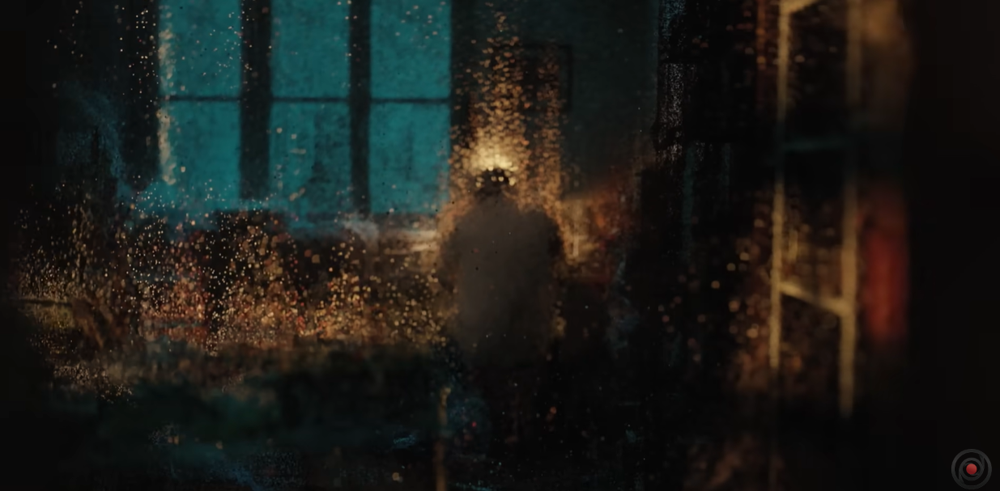
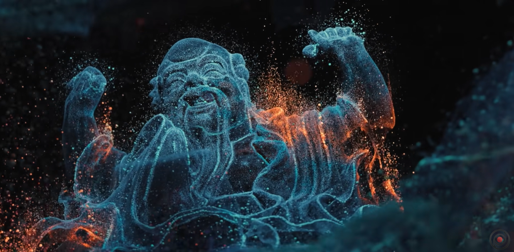

# Chen-Hung-I_hche0407_9103individualTask
## Individual Task Inspiration
>Choosen method：Perlin noise and randomness  

[Inspiration link](https://www.youtube.com/watch?v=mBGz30KY9WQ&t=681s)  
My inspiration is from a film project which the artist uses the point cloud technology to recreate the room of his deceased grandfather.
I really like this effect because it perfectly demonstrates a kind of dreamy atmosphere, suggesting that those memories are truly present but slowly fading away. 
This method is closely related to our chosen topic, __'Saint Georges majeur au crépuscule'__ which its creator Claude Monet based on his memories of his trip to Venice. I think this is a good way to illustrate the fading memory of Monet.

## Instructions

Upon opening, the particles will start emerging from the edge of the buildings, and the waves will slowly moved. When the screen is resized, the shapes and waves will move too.   

## Change Description for waves
1. To make the wave moved, first I remove the __'noLoop()'__ from __'setup()'__so the loop will not be stop upon refresh.  
2. I add an public array to store the waves.
>let waves = []; // Set up waves array to store waves
3. Add function setWaves() to give the waves initial settings.  
 function setWaves() {
  waveCount = windowHeight / 40;
  waves = []; // Clear existing waves in case of resize

  //This function is used to set up the wave
  for (let i = 0; i < waveCount; i++) {
    let y = startY + i * waveHeight; //y pos of the wave
    let randomAmplitude = random(5, 20); // The random amplitude of the wave
    let randomFrequency = random(0.01, 0.05); // The random frequency of the wave.
    let c1 = lerpColor(color(62, 192, 204), color(0, 0, 0), i / waveCount); //The starting color of the wave gradient.
    let c2 = lerpColor(color(62, 192, 204), color(0, 0, 0), (i + 1) / waveCount); //The ending color of the wave gradient.

    //adds a new wave object to the waves array.
    waves.push({
      y: y,
      randomAmplitude: randomAmplitude,
      randomFrequency: randomFrequency,
      c1: c1,
      c2: c2
    });
  }
}

[Example link](https://p5js.org/examples/simulate-particle-system.html)

>This example is a basic p5 particle system, which I believe is crucial for achieving my desired effect. Although there are many types of particle effects in P5.js, this effect has been chosen because it serves as the foundation for every particle system and is the easiest to implement. I anticipate using this effect extensively in creating the painting from scratch. Once the structure of the painting is established with this effect, I can then incorporate additional interactive effects such as Flocking or smoke particles based on this function.
