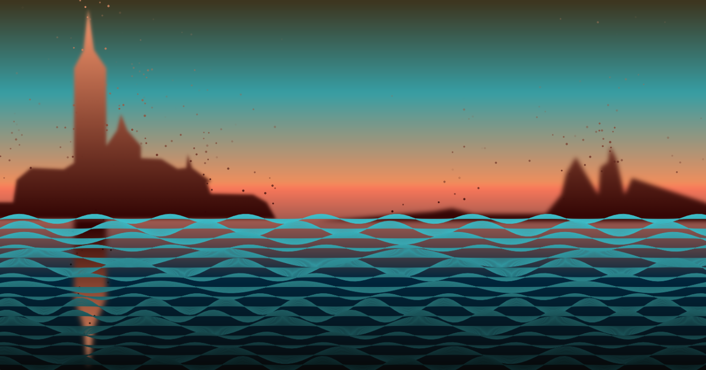
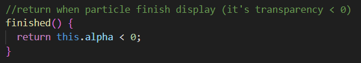

# Chen-Hung-I_hche0407_9103individualTask
## Individual Task Inspiration
>Choosen method：__'Perlin noise and randomness'__  

[Inspiration link](https://www.youtube.com/watch?v=mBGz30KY9WQ&t=681s)  
My inspiration is from a film project which the artist uses the point cloud technology to recreate the room of his deceased grandfather.
I really like this effect because it perfectly demonstrates a kind of dreamy atmosphere, suggesting that those memories are truly present but slowly fading away. 
This method is closely related to our chosen topic, __'Saint Georges majeur au crépuscule'__ which its creator Claude Monet based on his memories of his trip to Venice. I think this is a good way to illustrate the fading memory of Monet.

## Instructions

Upon opening, the particles will start emerging from the edges of the buildings, and the waves will slowly move. When the screen is resized, the shapes and waves will move too.   

## Change Description for waves
1. To make the wave moved, first I remove the `noLoop()` from `setup()` so the loop will not be stop upon refresh.  
2. I defined an public array to store the waves, and a variable to slow down the wave's movement.  
>let waves = []; // Set up waves array to store waves  
>let speed = 0.01; // Speed factor to slow down the wave movement  
3. Add function `setWaves()` to give the waves initial settings, and I changed to colours from the group code to fit in the style I want. This function is called in `setup()`.  
  
4. Nothing much has been changed here in the original `drawWave()`, I just moved the defined part to `setWaves()` and added a for loop to iterate over the waves.  
 

## Change Description for sky and skyReflection  
Nothing is changed in these two functions, I just change the colours of the gradient to fit in the style I want.  

## Change Description for buildings  
In the `drawBuilding()` function, I changed the way shapes are drawn. Now, I draw shapes using the vertices stored in `edgePoints[]`, allowing me to utilize those vertices for other purposes. I also changed the colors, added a new color stop in `linearGradient()`, and applied a blur to all the building shapes to match the style.  
 

## Change Description for adding particles  
1. To add particles generated from the edge of the shapes, I first defined three new arrays.  
>let particles = [];// Set up particles array to store particles
>let shapes = [];// Set up shapes array to store the 3 shapes
>let edgePoints = [];// set up edgePoints array to store the points that will appear on random position on the edge of the shapes  
2. In `setup()`, I convert all the coordinates of the 3 shapes I declared in `drawBuilding()` to vectors so that I can use those vertices to make interpolate points between each two vertices.  
  
3. In `interpolatePoints()`, I create multiple edge points from each 2 vertices I converted in `setup()` using the parameters given by `setup()`.  
 
4. In `draw()`, there are 3 parts of code with different function, the first part of code will create 10 new particles per frame and put them in the particles = [] array. 
 
The secound part of code will keep `update()` and `show()` in the `class Particle` running as long as there are still particles left in the particles = [] array. Also, it will remove the particle that is already finished its display out of the particles = [] array using splice().  
  
The third part of the code will create a new point from one of the point from edgePoints[] per frame, and feed this point's coordinates to `class Particle`.  
  
5. In `class Particle`, first I construct figures for every single particle with the x, y value I pass down from the previous step.  
  
The `finished()` function will return to the secound part of the code in `draw()` when the particle's transparency is less than 0.  
  
The `update()` function keeps update the movement, transparency, and colour of the particle.  
  
The `show()` function draws the particle with all the values I declared and updated above.  
  
With all the methods above, I can generate multiple particles from the edges of the three shapes with random radius. The color of each particle will change based on its y-coordinate as it moves, allowing the color of the particle to match the color of the buildings. 

## Uniqueness  
I add the particle system to the group code to mimic the point cloud effect, while the other two team members used Audio and Times to change the waves and add rain effects.  

## Reference  
[The Coding Train. (2018). Coding Challenge #78: Simple Particle System. 
](https://www.youtube.com/watch?v=UcdigVaIYAk)  
>I learned how to create class Particle with this tutorial by The Coding Train  

Tool used ：Chatgpt  
>I use Chatgpt to learned the idea of generating particles at the interpolate points of the shape's edge.

